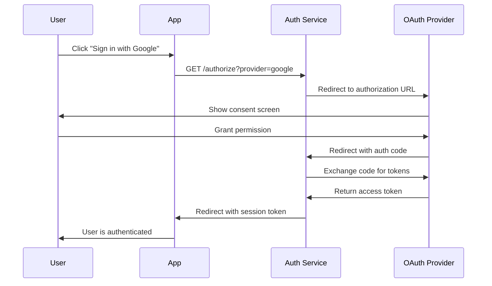

Initiate the OAuth 2.0 authorization flow by redirecting users to third-party OAuth providers. This endpoint supports multiple OAuth providers including Google, GitHub, Facebook, and others.

<Info>
This endpoint redirects users to the OAuth provider's authorization page. Users will be redirected back to your application after authorization.
</Info>

<RequestExample>

```bash cURL
curl -X GET "http://localhost:8080/authorize?provider=google&redirect_to=https://yourapp.com/dashboard"
```

```javascript JavaScript
// Redirect user to OAuth authorization
window.location.href = 'http://localhost:8080/authorize?provider=google&redirect_to=https://yourapp.com/dashboard';

// Or using fetch for programmatic redirect
const response = await fetch('http://localhost:8080/authorize?provider=google&redirect_to=https://yourapp.com/dashboard');
if (response.redirected) {
  window.location.href = response.url;
}
```

```python Python
import requests

# Get authorization URL
response = requests.get(
    'http://localhost:8080/authorize',
    params={
        'provider': 'google',
        'redirect_to': 'https://yourapp.com/dashboard'
    },
    allow_redirects=False
)

authorization_url = response.headers.get('Location')
print(f"Redirect user to: {authorization_url}")
```

```go Go
package main

import (
    "fmt"
    "net/http"
    "net/url"
)

func main() {
    baseURL := "http://localhost:8080/authorize"
    params := url.Values{}
    params.Add("provider", "google")
    params.Add("redirect_to", "https://yourapp.com/dashboard")
    
    authURL := fmt.Sprintf("%s?%s", baseURL, params.Encode())
    
    // Redirect user to authURL
    fmt.Printf("Redirect user to: %s\n", authURL)
}
```

</RequestExample>

## Query Parameters

<ParamField query="provider" type="string" required>
  OAuth provider to use for authentication.
  
  **Supported providers:**
  - `google` - Google OAuth
  - `github` - GitHub OAuth
  - `facebook` - Facebook OAuth
  - `twitter` - Twitter OAuth
  - `linkedin` - LinkedIn OAuth
  - `microsoft` - Microsoft OAuth
  - `apple` - Apple OAuth
  - `discord` - Discord OAuth
</ParamField>

<ParamField query="redirect_to" type="string">
  URL to redirect to after successful authentication. Must be a whitelisted URL.
</ParamField>

<ParamField query="scopes" type="string">
  Space-separated list of OAuth scopes to request. If not provided, uses default scopes for the provider.
</ParamField>

<ParamField query="state" type="string">
  Custom state parameter to include in the OAuth flow for CSRF protection.
</ParamField>

## Response

This endpoint returns a `302 Found` redirect response to the OAuth provider's authorization URL.

<ResponseField name="Location" type="string">
  The OAuth provider's authorization URL where the user should be redirected
</ResponseField>

<ResponseExample>

```http 302 - Redirect to OAuth Provider
HTTP/1.1 302 Found
Location: https://accounts.google.com/oauth/authorize?client_id=your_client_id&redirect_uri=http://localhost:8080/callback&response_type=code&scope=openid%20email%20profile&state=random_state_string
```

</ResponseExample>

## Error Responses

<ResponseExample>

```json 400 - Invalid Provider
{
  "code": 400,
  "msg": "Invalid OAuth provider",
  "details": "Provider 'invalid_provider' is not supported"
}
```

```json 400 - Invalid Redirect URL
{
  "code": 400,
  "msg": "Invalid redirect URL",
  "details": "Redirect URL must be whitelisted in your project settings"
}
```

```json 500 - OAuth Configuration Error
{
  "code": 500,
  "msg": "OAuth configuration error",
  "details": "OAuth provider is not properly configured"
}
```

</ResponseExample>

## OAuth Providers

### Google OAuth

```javascript
const authURL = 'http://localhost:8080/authorize?provider=google&scopes=openid email profile';
```

**Default scopes:** `openid email profile`

### GitHub OAuth

```javascript
const authURL = 'http://localhost:8080/authorize?provider=github&scopes=user:email';
```

**Default scopes:** `user:email`

### Facebook OAuth

```javascript
const authURL = 'http://localhost:8080/authorize?provider=facebook&scopes=email public_profile';
```

**Default scopes:** `email public_profile`

### Microsoft OAuth

```javascript
const authURL = 'http://localhost:8080/authorize?provider=microsoft&scopes=openid email profile';
```

**Default scopes:** `openid email profile`

### Apple OAuth

```javascript
const authURL = 'http://localhost:8080/authorize?provider=apple&scopes=name email';
```

**Default scopes:** `name email`

## Implementation Examples

### React OAuth Login Component

```jsx
import { useState } from 'react';

function OAuthLogin({ onSuccess, onError }) {
  const [loading, setLoading] = useState(null);

  const handleOAuthLogin = async (provider) => {
    setLoading(provider);
    
    try {
      // Store current URL for redirect after auth
      const redirectTo = encodeURIComponent(window.location.origin + '/dashboard');
      
      // Redirect to OAuth authorization
      const authURL = `${process.env.REACT_APP_AUTH_URL}/authorize?provider=${provider}&redirect_to=${redirectTo}`;
      
      window.location.href = authURL;
      
    } catch (error) {
      setLoading(null);
      onError?.(error.message);
    }
  };

  const providers = [
    { id: 'google', name: 'Google', icon: '🔍', color: '#4285f4' },
    { id: 'github', name: 'GitHub', icon: '🐙', color: '#333' },
    { id: 'facebook', name: 'Facebook', icon: '📘', color: '#1877f2' },
    { id: 'microsoft', name: 'Microsoft', icon: '🪟', color: '#0078d4' },
    { id: 'apple', name: 'Apple', icon: '🍎', color: '#000' }
  ];

  return (
    <div className="oauth-login">
      <h3>Sign in with</h3>
      
      <div className="oauth-providers">
        {providers.map((provider) => (
          <button
            key={provider.id}
            onClick={() => handleOAuthLogin(provider.id)}
            disabled={loading === provider.id}
            className="oauth-button"
            style={{ backgroundColor: provider.color }}
          >
            <span className="oauth-icon">{provider.icon}</span>
            <span className="oauth-text">
              {loading === provider.id ? 'Redirecting...' : `Continue with ${provider.name}`}
            </span>
          </button>
        ))}
      </div>
      
      <div className="oauth-divider">
        <span>or</span>
      </div>
    </div>
  );
}

export default OAuthLogin;
```

### OAuth State Management Hook

```jsx
import { useState, useEffect } from 'react';

function useOAuthState() {
  const [oauthState, setOAuthState] = useState(null);

  useEffect(() => {
    // Generate and store OAuth state for CSRF protection
    const state = generateRandomString(32);
    setOAuthState(state);
    sessionStorage.setItem('oauth_state', state);
  }, []);

  const generateRandomString = (length) => {
    const chars = 'ABCDEFGHIJKLMNOPQRSTUVWXYZabcdefghijklmnopqrstuvwxyz0123456789';
    let result = '';
    for (let i = 0; i < length; i++) {
      result += chars.charAt(Math.floor(Math.random() * chars.length));
    }
    return result;
  };

  const validateState = (returnedState) => {
    const storedState = sessionStorage.getItem('oauth_state');
    return storedState === returnedState;
  };

  const clearState = () => {
    sessionStorage.removeItem('oauth_state');
    setOAuthState(null);
  };

  return {
    oauthState,
    validateState,
    clearState
  };
}

export default useOAuthState;
```

### OAuth Provider Configuration

```jsx
import { useState, useEffect } from 'react';

function OAuthProviderConfig() {
  const [providers, setProviders] = useState([]);
  const [loading, setLoading] = useState(true);

  useEffect(() => {
    fetchProviders();
  }, []);

  const fetchProviders = async () => {
    try {
      const response = await fetch('/api/oauth/providers');
      const data = await response.json();
      setProviders(data.providers);
    } catch (error) {
      console.error('Failed to fetch OAuth providers:', error);
    } finally {
      setLoading(false);
    }
  };

  const handleProviderToggle = async (providerId, enabled) => {
    try {
      await fetch(`/api/oauth/providers/${providerId}`, {
        method: 'PATCH',
        headers: {
          'Content-Type': 'application/json',
          'Authorization': `Bearer ${process.env.REACT_APP_SERVICE_ROLE_KEY}`
        },
        body: JSON.stringify({ enabled })
      });
      
      setProviders(prev => 
        prev.map(p => 
          p.id === providerId ? { ...p, enabled } : p
        )
      );
    } catch (error) {
      console.error('Failed to update provider:', error);
    }
  };

  if (loading) return <div>Loading providers...</div>;

  return (
    <div className="oauth-config">
      <h2>OAuth Provider Configuration</h2>
      
      <div className="providers-list">
        {providers.map((provider) => (
          <div key={provider.id} className="provider-item">
            <div className="provider-info">
              <h3>{provider.name}</h3>
              <p>{provider.description}</p>
              <div className="provider-status">
                Status: {provider.configured ? '✅ Configured' : '❌ Not configured'}
              </div>
            </div>
            
            <div className="provider-controls">
              <label className="toggle-switch">
                <input
                  type="checkbox"
                  checked={provider.enabled}
                  onChange={(e) => handleProviderToggle(provider.id, e.target.checked)}
                  disabled={!provider.configured}
                />
                <span className="toggle-slider"></span>
              </label>
            </div>
          </div>
        ))}
      </div>
    </div>
  );
}

export default OAuthProviderConfig;
```

### Node.js OAuth Redirect Handler

```javascript
const express = require('express');
const { query, validationResult } = require('express-validator');

const router = express.Router();

// Supported OAuth providers
const SUPPORTED_PROVIDERS = [
  'google', 'github', 'facebook', 'twitter', 
  'linkedin', 'microsoft', 'apple', 'discord'
];

router.get('/authorize', [
  query('provider').isIn(SUPPORTED_PROVIDERS),
  query('redirect_to').optional().isURL(),
  query('scopes').optional().isString(),
  query('state').optional().isString()
], async (req, res) => {
  try {
    // Check validation errors
    const errors = validationResult(req);
    if (!errors.isEmpty()) {
      return res.status(400).json({
        code: 400,
        msg: 'Invalid request parameters',
        details: errors.array()
      });
    }

    const { provider, redirect_to, scopes, state } = req.query;

    // Validate redirect URL against whitelist
    if (redirect_to && !isWhitelistedURL(redirect_to)) {
      return res.status(400).json({
        code: 400,
        msg: 'Invalid redirect URL',
        details: 'Redirect URL must be whitelisted in your project settings'
      });
    }

    // Build authorization URL
    const authParams = new URLSearchParams({
      provider,
      ...(redirect_to && { redirect_to }),
      ...(scopes && { scopes }),
      ...(state && { state })
    });

    const authURL = `${process.env.AUTH_SERVICE_URL}/authorize?${authParams}`;

    // Redirect to Strike Auth Service
    res.redirect(authURL);

  } catch (error) {
    console.error('OAuth authorization error:', error);
    res.status(500).json({
      code: 500,
      msg: 'Internal server error',
      details: 'Please try again later'
    });
  }
});

function isWhitelistedURL(url) {
  const whitelistedDomains = process.env.WHITELISTED_DOMAINS?.split(',') || [];
  
  try {
    const urlObj = new URL(url);
    return whitelistedDomains.some(domain => 
      urlObj.hostname === domain || urlObj.hostname.endsWith(`.${domain}`)
    );
  } catch {
    return false;
  }
}

module.exports = router;
```

## Security Considerations

- **State Parameter**: Always use the state parameter for CSRF protection
- **Redirect URL Validation**: Ensure redirect URLs are whitelisted
- **Scope Limitation**: Request only necessary OAuth scopes
- **HTTPS Required**: Use HTTPS in production for secure redirects
- **Provider Configuration**: Properly configure OAuth apps with providers

## OAuth Flow Diagram



## Best Practices

<AccordionGroup>
  <Accordion title="Security">
    - Always use HTTPS in production
    - Implement proper state validation
    - Whitelist redirect URLs
    - Use minimal required scopes
    - Validate OAuth responses
  </Accordion>

  <Accordion title="User Experience">
    - Provide clear provider selection
    - Show loading states during redirects
    - Handle OAuth errors gracefully
    - Offer alternative authentication methods
    - Remember user's preferred provider
  </Accordion>

  <Accordion title="Error Handling">
    - Handle network errors during redirects
    - Provide fallback authentication methods
    - Log OAuth errors for debugging
    - Show user-friendly error messages
    - Implement retry mechanisms
  </Accordion>
</AccordionGroup>

## Testing

### Unit Tests

```javascript
describe('GET /authorize', () => {
  test('should redirect to Google OAuth', async () => {
    const response = await request(app)
      .get('/authorize')
      .query({
        provider: 'google',
        redirect_to: 'https://example.com/dashboard'
      })
      .expect(302);

    expect(response.headers.location).toContain('accounts.google.com');
  });

  test('should reject invalid provider', async () => {
    await request(app)
      .get('/authorize')
      .query({
        provider: 'invalid_provider'
      })
      .expect(400);
  });

  test('should reject non-whitelisted redirect URL', async () => {
    await request(app)
      .get('/authorize')
      .query({
        provider: 'google',
        redirect_to: 'https://malicious-site.com'
      })
      .expect(400);
  });
});
```

## Related Endpoints

<CardGroup cols={2}>
  <Card
    title="OAuth Callback"
    icon="arrow-turn-down-left"
    href="/api-reference/oauth/callback"
  >
    Handle OAuth provider callbacks
  </Card>
  <Card
    title="Login"
    icon="right-to-bracket"
    href="/api-reference/authentication/login"
  >
    Traditional email/password login
  </Card>
  <Card
    title="Signup"
    icon="user-plus"
    href="/api-reference/authentication/signup"
  >
    Create new user accounts
  </Card>
  <Card
    title="Logout"
    icon="right-from-bracket"
    href="/api-reference/user/logout"
  >
    End user sessions
  </Card>
</CardGroup> 